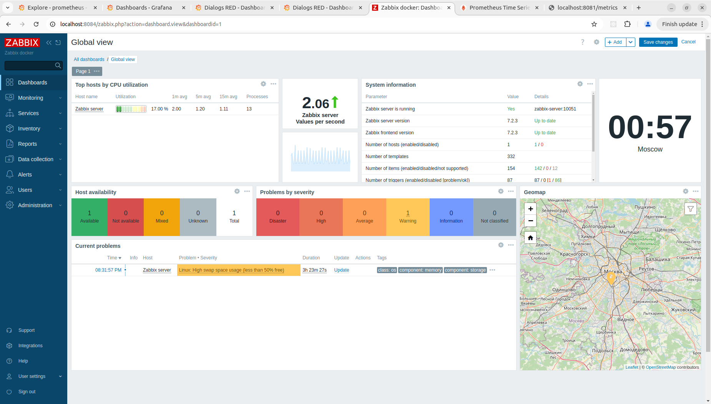
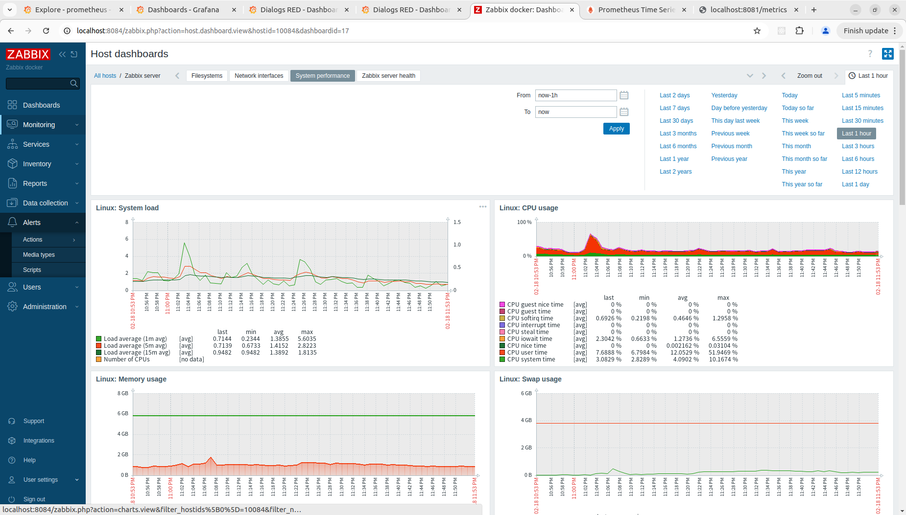
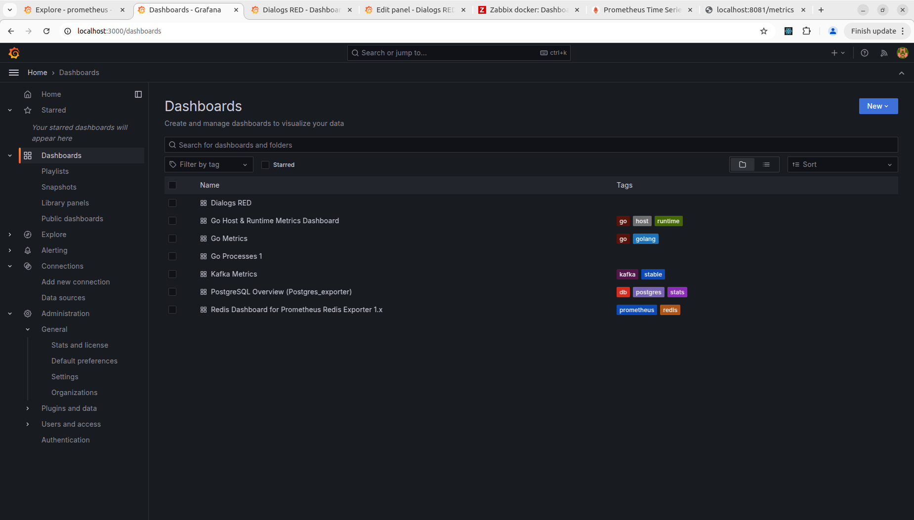
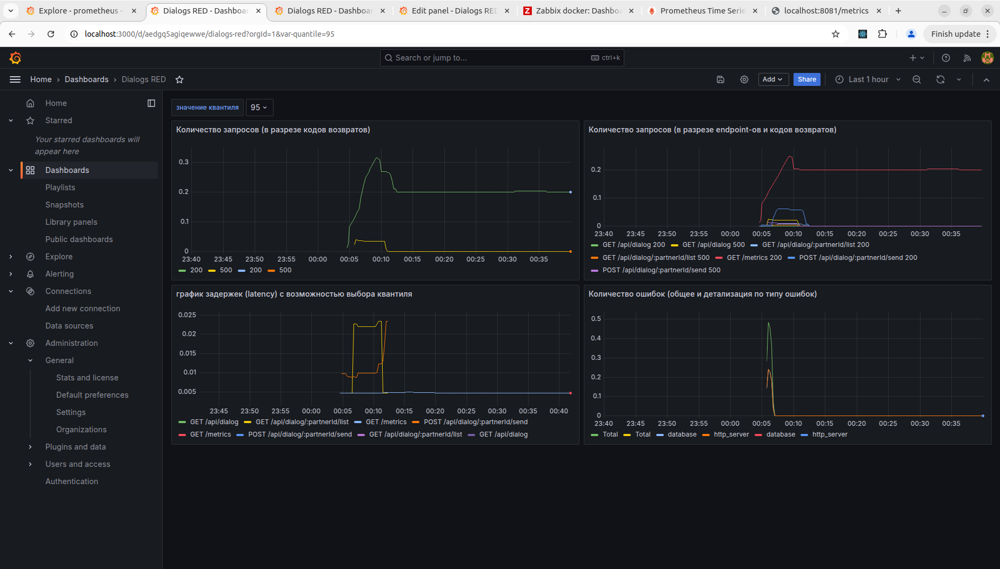
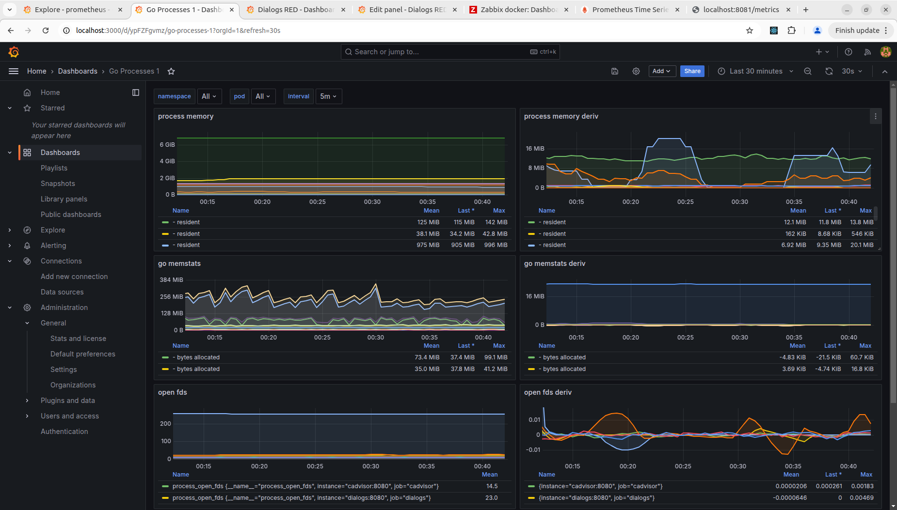
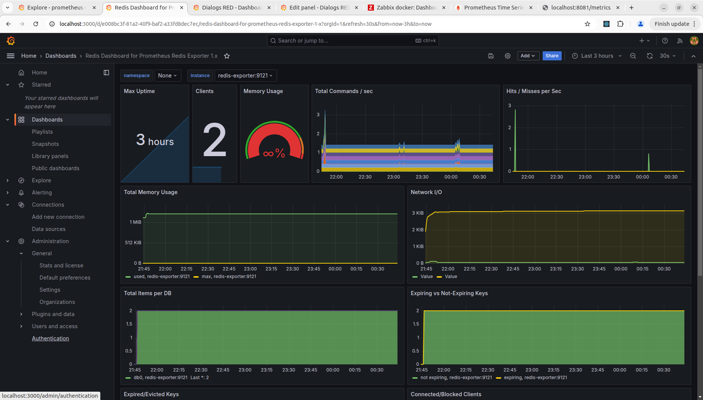
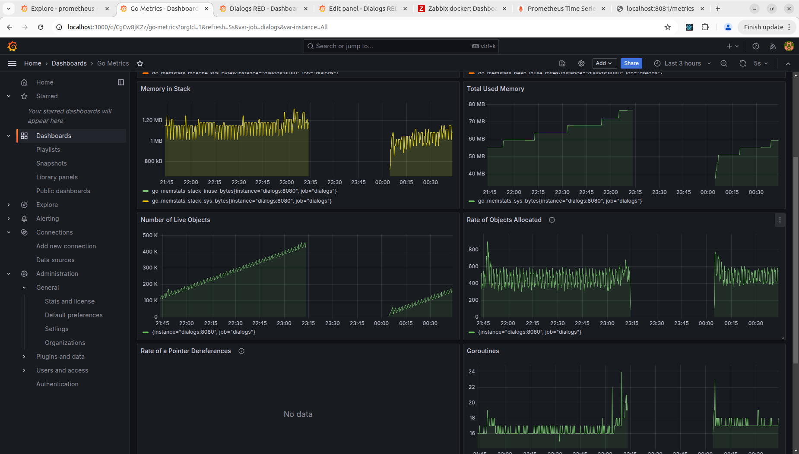

## Домашнее задание

Мониторинг

Цель:

В результате выполнения ДЗ вы организуете мониторинг своего сервиса чатов.

В данном задании тренируются навыки:

- эксплутация prometheus;
- эксплутация grafana;
- эксплутация zabbix.

  

Описание/Пошаговая инструкция выполнения домашнего задания:

Необходимо:

- развернуть [zabbix](https://www.zabbix.com/ "zabbix");
- развернуть [prometheus](https://prometheus.io/ "prometheus");
- развернуть [grafana](https://grafana.com/ "grafana");
- начать писать в [prometheus](https://prometheus.io/ "prometheus") бизнес-метрики сервиса чатов по принципу RED;
- начать писать в [zabbix](https://www.zabbix.com/ "zabbix") технические метрики сервера с сервисом чатов;
- организовать дашборд в [grafana](https://grafana.com/ "grafana");

  
Форма сдачи ДЗ  
  
Отчет со скриншотами

  

Критерии оценки:

Оценка происходит по принципу зачет/незачет.

Требования:

1. Сбор технических метрик осуществляется верно.
2. Сбор бизнес метрик осуществляется верно по принципу RED.
3. В grafana организован дашборд.

  

Компетенции:

- Разработка и проектирование высоконагруженных систем
    - - осуществлять мониторинг и алертинг

## Отчет о проделанной работе

### 1. Основные изменения в проекте

#### 1.1 Добавлена поддержка мониторинга (Prometheus + Grafana)

В проект интегрированы RED-метрики, а также система мониторинга с использованием Prometheus и Grafana:

- Добавлены middleware для сбора RED-метрик в [`common/infrastructure/http/middleware/metrics.go`](https://github.com/Vasiliy82/otus-hla-homework/blob/b9aeb22c87c434eb44fe2069c1840d61441b4db3/common/infrastructure/http/middleware/metrics.go#L1-L104).
- В `main.go` сервиса `dialogs` добавлены:
    - Middleware для Prometheus-метрик.
    - `GET /metrics` – эндпоинт для экспорта метрик в Prometheus.
- Настроены отдельные экспортеры для:
    - PostgreSQL (`postgres-exporter`).
    - Redis (`redis-exporter`).
    - Kafka JMX Exporter (`jmx_prometheus_javaagent.jar`).
    - Docker-контейнеров (`cadvisor`).
- Добавлен `prometheus.yml` с настройками `scrape_configs`.

#### 1.2 Добавлены метрики сервиса `dialogs`

1. Общее количество HTTP-запросов:
    
    ```go
    metrics.RequestCount.WithLabelValues(c.Request().Method, c.Path(), statusStr).Inc()
    ```
    
2. Латентность ответов (гистограмма):
    
    ```go
    metrics.RequestLatency.WithLabelValues(c.Request().Method, c.Path()).Observe(latency)
    ```
    
3. Классификация ошибок (логические ошибки + HTTP ошибки):
    
    ```go
    if err != nil {
        errorType := classifyError(err)
        metrics.ServiceErrors.WithLabelValues(errorType).Inc()
    }
    ```
    
    Ошибки классифицируются как:
    - `database` – ошибки подключения к БД.
    - `http_client` – ошибки 400-499.
    - `http_server` – ошибки 500+.
    Данная классификация дана в качестве примера. Для реализации полноценного мониторинга за ошибками следует научиться различать ошибки по типу (технические и бизнес-ошибки) и накручивать счетчики в слое бизнес-логики, т.к. не все процессы проходят через HTTP Middleware: могут быть еще взаимодействие с брокером, регулярные задания, ошибки во время запуска и остановки сервисов, и др.

#### 1.3 Улучшена архитектура микросервисов

- В `socnet.yaml` добавлены новые эндпоинты с поддержкой версионирования API.
- Обновлена конфигурация PostgreSQL (`postgresql.conf`, `pg_hba.conf`).
- Добавлены миграции для БД с помощью goose.
- Kafka теперь запускается с конфигурацией идемпотентных продюсеров (`enable_idempotence: true`).

---

### 2. Новые возможности в DevOps

#### 2.1 Автоматизация развертывания

- Добавлен `Makefile` для автоматизированного запуска контейнеров и миграций.
- Настроен `docker-compose` (`compose.yml`), включающий:
    - Kafka
    - PostgreSQL
    - Redis
    - Prometheus
    - Grafana
    - Zabbix
    - cAdvisor
    - PostgreSQL-экспортер
    - Redis-экспортер
- Теперь можно запустить систему одной командой:
    
    ```sh
    make up
    ```
    

#### 2.2 Мониторинг в Grafana

- Добавлены дашборды:
    - RED-метрики (`http_requests_total`, `http_request_duration_seconds`, `service_errors_total`).
    - PostgreSQL (`postgres-exporter`).
    - Redis (`redis-exporter`).
    - Kafka (`jmx_prometheus_javaagent.jar`).
    - cAdvisor (мониторинг контейнеров).
- Теперь Grafana доступна по `http://localhost:3000`.

#### 2.3 Интеграция с Zabbix

- Поднят Zabbix Server + Zabbix Agent.
- Теперь Zabbix собирает метрики ЦП, памяти, диска и сети с контейнеров.

#### 2.4 Скриншоты метрик

##### 2.4.1 Zabbix




##### 2.4.2 Grafana
**Список дашбордов**



**Метрики по принципу RED**



**Метрики процесса Go**



**Метрики Redis (дашборд из коллекции Графаны, некоторые метрики глючат)**



**Постоянно растущий график Live objects указывает на возможную утечку памяти**

