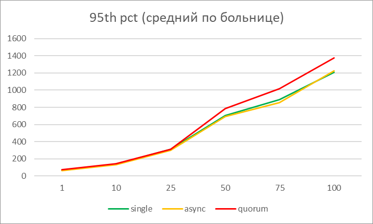
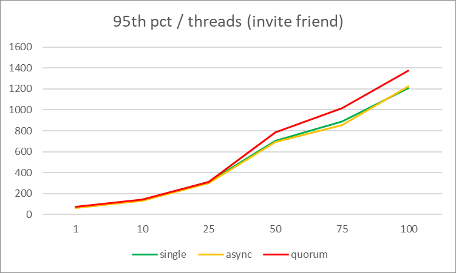
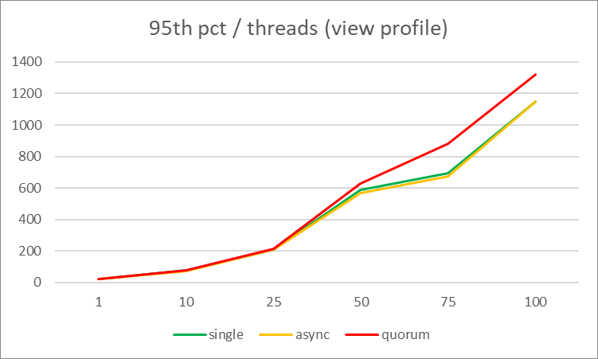
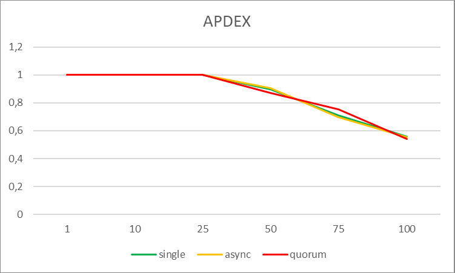
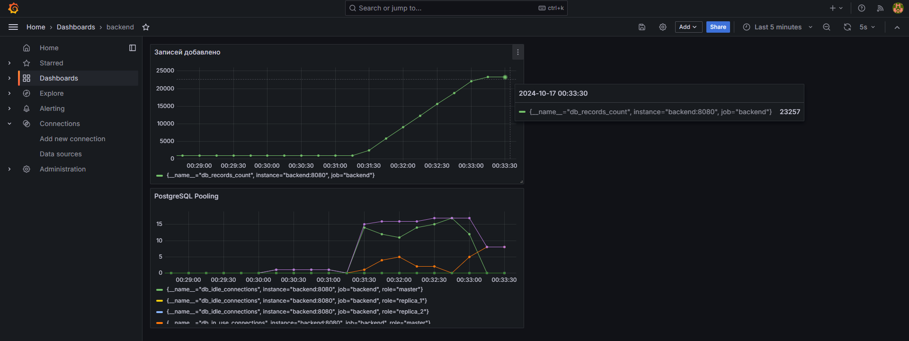

# ДЗ №3. Отчет о проделанной работе
## 1. Постановка задачи
**Цель**
В результате выполнения ДЗ вы настроите разные виды репликации, протестируете их влияние на производительность системы и убедитесь, что в случае синхронной репликации вы не теряете данные при аварии. В данном задании тренируются навыки:
- обеспечение отказоустойчивости проекта;
- администрирование PostgreSQL;
- настройка репликации;
- проведение нагрузочных тестов.

**Описание ДЗ:**
1. Выбираем 2 запроса на чтение ([/user/get/{id}](https://github.com/OtusTeam/highload/blob/master/homework/openapi.json#L127) и [/user/search](https://github.com/OtusTeam/highload/blob/master/homework/openapi.json#L167) из [спецификации](https://github.com/OtusTeam/highload/blob/master/homework/openapi.json)). Составить план нагрузочного тестирования, который шлет запросы на эти api.
2. Создаем нагрузку на чтение с помощью составленного на предыдущем шаге плана, делаем замеры.    
3. Настроить 2 слейва и 1 мастер. Включить потоковую репликацию.    
4. Добавить в проект replicated datasource:
Можно рассмотреть несколько несколько вариантов:
- Использование [MaxScale](https://github.com/mariadb-corporation/MaxScale) и [MySql Replication JDBC Driver](http://dev.mysql.com/doc/connector-j/en/connector-j-master-slave-replication-connection.html)
- Использование Database Proxy server like [MySQL Proxy](http://dev.mysql.com/doc/mysql-proxy/en/)
- Использование Replication DataSource: [kwon37xi/replication-datasource-boot](https://github.com/kwon37xi/replication-datasource-boot).
Рекомендуется последний вариант: написать `ReplicationRoutingDataSource`, который выбирает использовать master или slave в зависимости от типа транзакции.
Данное решение работает с [TransactionSynchronizationManager](http://docs.spring.io/spring-framework/docs/current/javadoc-api/org/springframework/transaction/support/TransactionSynchronizationManager.html).
При использовании [Spring framework](http://spring.io/) достаточно установить `@Transactional(readOnly = true|false)`
Переносим запросы на чтение (transaction == read only) на чтение со слейва.
5. Создаем нагрузку на чтение с помощью составленного на предыдущем шаге плана, делаем замеры. Добавить сравнение результатов в отчет.
6. Настроить кворумную синхронную репликацию.
(Опционально) воспользоваться одним из кластерных расширения Postgres (например patroni).
9. Создать нагрузку на запись в любую тестовую таблицу. На стороне, которой нагружаем считать, сколько строк мы успешно записали.
   Например, API:
   - PUT /friend/set/{user_id}
   - POST /user/register

Пример: [Дашборды для Grafana](https://grafana.com/grafana/dashboards/893)

10. Убиваум одну из реплик (kill -9, docker stop)
11. Заканчиваем нагрузку на запись.
12. Выбираем самый свежий слейв. Промоутим его до мастера. Переключаем на него второй слейв.
13. Проверяем, есть ли потери транзакций.

**Форма сдачи ДЗ**
- Отчет о проделанной работе
- Предоставить докеризированное приложение, которое можно запустить при помощи docker-compose (может лежать рядом с исходным кодом) ИЛИ развернутое приложение, доступное извне ИЛИ инструкция по запуску
- Предоставить ссылку на исходный код (github, gitlab, etc)

## 2. План нагрузочного тестирования
### 2.1 Краткий план нагрузочного тестирования:
2.1.1 **Регистрация нового пользователя**:
    - Отправляем запрос на регистрацию с генерируемыми данными.
    - Запоминаем `username` и `password`.
2.1.2 **Авторизация пользователя**:
    - Логинимся с использованием `username` и `password`.
    - Запоминаем полученный `token`.
2.1.3 **Поиск пользователей**:
    - Выполняем 100 запросов на поиск случайных пользователей по первым буквам имени и фамилии (например, `"Te"` и `"La"`).
2.1.4 **Просмотр профиля**:
    - После каждого успешного поиска выполняем запрос на получение профиля первого пользователя из выдачи.
2.1.5 **Добавление в друзья**:
    - После получения профиля добавляем этого пользователя в друзья с помощью API.
### 2.2 Регистрация нового пользователя
**Endpoint**:  `POST /api/user/register`
**Описание**:  Отправляем запрос на регистрацию нового пользователя с тестовыми данными.
**Параметры (тело запроса)**:
```json
{
  "first_name": "TestFirstName",
  "last_name": "TestLastName",
  "sex": "male",
  "birthdate": "1990-01-01",
  "biography": "Test biography",
  "city": "TestCity",
  "username": "testuser@example.com",
  "password": "password123"
}
```
**Ответ (пример)**:
```json
{
  "id": "6547de8a-f411-4d0b-87e8-8d4a627f153c"
}
```
**Комментарий**:  Запоминаем `username`, `password`, которые понадобится для авторизации.
### 2.3 Авторизация пользователя
**Endpoint**:  `POST /api/login`
**Описание**:  Отправляем запрос на авторизацию пользователя с логином и паролем, полученными после регистрации.
**Параметры (тело запроса)**:
```json
{
  "username": "testuser@example.com",
  "password": "password123"
}
```
**Ответ (пример)**:
```json
{
  "id": "user_id",
  "token": "jwt_token"
}
```
**Комментарий**:  Запоминаем `token`, который понадобится для выполнения запросов, требующих авторизации.

---
### 2.4 Поиск пользователей
**Endpoint**:  `GET /api/user/search`
**Описание**:  Выполняем запрос на поиск пользователей по первым буквам имени и фамилии.
**Параметры (query string)**:
- `first_name`: первые две буквы имени (например, `"Te"`)
- `last_name`: первые две буквы фамилии (например, `"La"`)
**Заголовок**:  
- `Authorization: Bearer <jwt_token>` (JWT-токен, полученный в предыдущем шаге)
**Ответ (пример)**:
```json
[
  {
    "id": "user1_id",
    "first_name": "Test1",
    "last_name": "Last1"
  },
  {
    "id": "user2_id",
    "first_name": "Test2",
    "last_name": "Last2"
  }
]
```
**Комментарий**: пользователь многократно выполняет этот запрос (например, 100 раз).

---
### 2.5 Просмотр профиля первого пользователя из выдачи
**Endpoint**:  `GET /api/user/get/{id}`
**Описание**:  После успешного поиска, пользователь просматривает профиль случайно выбранного пользователя из списка результатов поиска.
**Параметры**:
- `id`: идентификатор найденного пользователя (например, `"user1_id"`)
**Заголовок**:  
- `Authorization: Bearer <jwt_token>`
**Ответ (пример)**:
```json
{
  "id": "user1_id",
  "first_name": "Test1",
  "last_name": "Last1",
  "birthdate": "1990-01-01",
  "biography": "User biography",
  "city": "TestCity"
}
```

### 2.6 Добавление найденного пользователя в друзья
**Endpoint**:  `GET /api/friend/add/{id}`
**Описание**:  Пользователь добавляет случайно выбранного пользователя из списка результатов поиска в друзья.
**Параметры**:
- `id`: идентификатор найденного пользователя (например, `"user1_id"`)
**Заголовок**:  
- `Authorization: Bearer <jwt_token>`
**Ответ**:
- 200 Ok или 201 Created или 204 No content

## 3. Реализация недостающих Endpoint-ов
Доработка реализована в коммите: [commit](https://github.com/Vasiliy82/otus-hla-homework/commit/3846aeb4c39402bac7e9c71a80b51e2d3b321dee)
Разработаны следующие endpoint-ы:
**3.1 Доработан Endpoint `GET /api/friend/add/{id}`**
[~/backend/internal/infrastructure/httpserver/httpserver.go](https://github.com/Vasiliy82/otus-hla-homework/blob/3846aeb4c39402bac7e9c71a80b51e2d3b321dee/backend/internal/infrastructure/httpserver/httpserver.go#L44)
[~/backend/internal/rest/user_handler.go](https://github.com/Vasiliy82/otus-hla-homework/blob/3846aeb4c39402bac7e9c71a80b51e2d3b321dee/backend/internal/rest/user_handler.go#L137-L172)
[~/backend/internal/services/user/user.go](https://github.com/Vasiliy82/otus-hla-homework/blob/3846aeb4c39402bac7e9c71a80b51e2d3b321dee/backend/internal/services/user/user.go#L99-L111)
[~/backend/internal/repository/user.go](https://github.com/Vasiliy82/otus-hla-homework/blob/3846aeb4c39402bac7e9c71a80b51e2d3b321dee/backend/internal/repository/user.go#L81-L97)

**3.2 Доработан Endpoint `GET /api/friend/remove/{id}`**
[~/backend/internal/infrastructure/httpserver/httpserver.go](https://github.com/Vasiliy82/otus-hla-homework/blob/3846aeb4c39402bac7e9c71a80b51e2d3b321dee/backend/internal/infrastructure/httpserver/httpserver.go#L45)
[~/backend/internal/rest/user_handler.go](https://github.com/Vasiliy82/otus-hla-homework/blob/3846aeb4c39402bac7e9c71a80b51e2d3b321dee/backend/internal/rest/user_handler.go#L174-L209)
[~/backend/internal/services/user/user.go](https://github.com/Vasiliy82/otus-hla-homework/blob/3846aeb4c39402bac7e9c71a80b51e2d3b321dee/backend/internal/services/user/user.go#L113-L122)
[~/backend/internal/repository/user.go](https://github.com/Vasiliy82/otus-hla-homework/blob/3846aeb4c39402bac7e9c71a80b51e2d3b321dee/backend/internal/repository/user.go#L99-L112)
## 4. Доработка DAL: перенос readonly транзакций на реплики
Доработка реализована в коммите: [commit](https://github.com/Vasiliy82/otus-hla-homework/commit/3846aeb4c39402bac7e9c71a80b51e2d3b321dee)
**4.1 В качестве Replicated Datasource реализован объект DBCluster - кластер БД с функцией выбора экземпляра для читающих/пишущих операций**
[~/backend/internal/infrastructure/postgresqldb/dbcluster.go](https://github.com/Vasiliy82/otus-hla-homework/blob/9af47abe662bc769c9a8c3ff80058c0490f3713b/backend/internal/infrastructure/postgresqldb/dbcluster.go)
**4.2 Доработан мониторинг метрик с учетом появления master/replica подключений**
[~/backend/internal/infrastructure/postgresqldb/metrics.go](https://github.com/Vasiliy82/otus-hla-homework/blob/9af47abe662bc769c9a8c3ff80058c0490f3713b/backend/internal/infrastructure/postgresqldb/metrics.go)
**4.3 В конфигурацию сервиса добавлены настройки реплик для подключения**
[~/backend/app-local.yaml](https://github.com/Vasiliy82/otus-hla-homework/blob/9af47abe662bc769c9a8c3ff80058c0490f3713b/backend/app-local.yaml)
## 5. Результаты нагрузочного тестирования
### 5.1   95-й перцентиль по всем endpoint-ам / количество потоков (среднее)

| Threads | 1   | 10  | 25  | 50  | 75   | 100  |
| ------- | --- | --- | --- | --- | ---- | ---- |
| single  | 67  | 140 | 310 | 707 | 891  | 1210 |
| async   | 61  | 130 | 298 | 691 | 853  | 1225 |
| quorum  | 72  | 145 | 311 | 787 | 1016 | 1375 |

**Комментарий**: Время отклика для всех вариантов репликации немного увеличивается с ростом числа потоков. Разница между single и async репликацией минимальна, а использование кворума добавляет некоторое увеличение задержек, но разница остается умеренной, что ожидаемо при использовании более сложных механизмов репликации.

### 5.2   95-й перцентиль по запросу на запись в БД (invite friend)

| Threads | 1   | 10  | 25  | 50  | 75  | 100 |
| ------- | --- | --- | --- | --- | --- | --- |
| single  | 27  | 81  | 211 | 469 | 612 | 807 |
| async   | 26  | 75  | 204 | 448 | 653 | 778 |
| quorum  | 33  | 84  | 210 | 524 | 698 | 948 |

Комментарий: При запросах на запись добавление репликации также приводит к небольшому увеличению задержек. Async репликация практически не влияет на производительность, тогда как кворумная репликация показывает более выраженный рост задержек на высоких потоках, но это остается в допустимых пределах.

### 5.3   95-й перцентиль по запросу на чтение из БД (view profile)


| Threads | 1   | 10  | 25  | 50  | 75  | 100  |
|---------|-----|-----|-----|-----|-----|------|
| single  | 20  | 79  | 210 | 587 | 692 | 1148 |
| async   | 19  | 70  | 207 | 569 | 676 | 1147 |
| quorum  | 19  | 75  | 215 | 630 | 879 | 1322 |

**Комментарий**: Время отклика для чтения в режиме async практически идентично single, что указывает на высокую эффективность асинхронной репликации при чтении. В случае кворумной репликации наблюдается некоторое увеличение задержек при высокой нагрузке, но оно ожидаемо и не критично для производительности.

### 5.4   APDEX


| Threads | 1   | 10  | 25  | 50    | 75    | 100   |
| ------- | --- | --- | --- | ----- | ----- | ----- |
| single  | 1   | 1   | 1   | 0.898 | 0.708 | 0.56  |
| async   | 1   | 1   | 1   | 0.904 | 0.698 | 0.552 |
| quorum  | 1   | 1   | 1   | 0.872 | 0.754 | 0.539 |

**Комментарий**: APDEX результаты показывают, что разница в удовлетворенности пользователей при различных схемах репликации незначительна. На высокой нагрузке показатели немного ухудшаются для кворумной репликации, что ожидаемо при увеличении сложности системы, но в целом влияние на производительность минимально.
### 5.6. Выводы по результатам нагрузочного тестирования
- **Отсутствие прироста производительности при чтении с реплик:** Несмотря на то, что в вариантах с асинхронной репликацией и кворумом запросы читались с двух серверов вместо одного, ожидаемого улучшения производительности не наблюдалось. Это может быть связано с особенностями оборудования, на котором проводилось тестирование. Тесты выполнялись на одной физической машине, что привело к тому, что дисковая подсистема стала узким местом, а бюджет IOPS был разделен между всеми участниками теста.
    
- **Ошибки в асинхронной репликации:** В асинхронной репликации были зафиксированы 4 ошибки, связанные с тем, что данные не успели синхронизироваться со slave сервером, когда запросы на чтение приходили сразу после записи на master. Однако при общем количестве запросов ~25,000, это составляет незначительную долю и не оказывает серьезного влияния на итоговые результаты.

## 6. Тест на потерю транзакций при кворумной репликации
Сценарий тестирования:
- создать нагрузку на запись в БД в определенную таблицу;
- во время нагрузки остановить master узел;
- определить реплику, обладающую более полными данными;
- проверить полноту данных на реплике (сравнить данные от backend о фактически сохраненных строках с данными в БД реплики).
План работ:
- **доработать backend**: для endpoint `/api/user/register` добавить метрику: регистрировать количество фактически сохраненных записей в БД;
- **запустить тестирование** в конфигурации: master + 2 * slave, настроить режим кворумной репликации, создать нагрузку на endpoint `/api/user/register` ;
- **прервать выполнение master** реплики командой `docker compose kill <имя сервиса>`;
- **определить наиболее актуальную реплику** (проверить текущие LSN на слейвах:  `pg_last_wal_receive_lsn()` — показывает, до какого момента WAL был получен на реплике; `pg_last_wal_replay_lsn()` — показывает, до какого момента WAL был воспроизведен; `pg_last_xact_replay_timestamp()` — время последней воспроизведенной транзакции);
- **повысить выбранную реплику до master-а** командой pg_promote();
- **проверить сохранившиеся данные**.
### 6.1 доработка backend
Доработка реализована в коммите [commit](https://github.com/Vasiliy82/otus-hla-homework/commit/f084323899b16cb5cbdfc0201194932a879bf4a4)

### 6.2 запуск теста
Нагрузка выполнялась с помощью JMeter. В качестве запроса на регистрацию отправлялся запрос, описанный в  [[#2.2 Регистрация нового пользователя]]. Количество потоков = 100.
### 6.3 определение наиболее актуальной реплики
```bash
$ docker compose exec postgres_slave1 psql -U app_hw -d hw -t -c "SELECT pg_last_wal_receive_lsn();"
 0/246E8AD0

$ docker compose exec postgres_slave1 psql -U app_hw -d hw -t -c "SELECT pg_last_wal_replay_lsn();"
 0/246E8AD0

$ docker compose exec postgres_slave2 psql -U app_hw -d hw -t -c "SELECT pg_last_wal_receive_lsn();"
 0/246E8AD0

$ docker compose exec postgres_slave2 psql -U app_hw -d hw -t -c "SELECT pg_last_wal_replay_lsn();"
 0/246E8AD0
```

### 6.4 повышение репл
```bash
$ docker compose exec postgres_slave1 psql -U app_hw -d hw -c "SELECT pg_promote();"
 pg_promote 
------------
 t
(1 row)
```


### 6.5 проверка

```bash
docker compose exec postgres_slave1 psql -U app_hw -d hw -c "SELECT COUNT(*) FROM users;"
  count  
---------
 1134124
(1 row)
```

-- количество записей в БД перед запуском теста (select count(*) from users) = 1111787
-- значение счетчика в Графане перед запуском теста = 920
-- значение счетчика в Графане после остановки master = 23257
-- количество записей в БД после остановки master (select count(*) from users) = 1134124
-- добавлено записей по данным из Графаны = 23257 - 920 = 22337
-- добавлено записей по данным из SQL = 1134124 - 1111787 = 22337


## 6. Тест на потерю транзакций при кворумной репликации

### Сценарий тестирования:
1. Создать нагрузку на запись в БД в определенную таблицу.
2. Во время нагрузки остановить мастер-узел.
3. Определить реплику с более полными данными.
4. Проверить полноту данных на реплике, сравнив количество фактически сохраненных строк в БД с backend-данными.

### Протокол тестирования:
1. **Доработка backend**:
   Для endpoint `/api/user/register` была добавлена метрика, регистрирующая количество фактически сохраненных записей в БД. Изменения были внесены в коммите [commit](https://github.com/Vasiliy82/otus-hla-homework/commit/f084323899b16cb5cbdfc0201194932a879bf4a4).
   
    [~/backend/internal/repository/metrics.go](https://github.com/Vasiliy82/otus-hla-homework/blob/f084323899b16cb5cbdfc0201194932a879bf4a4/backend/internal/repository/metrics.go)  
    [~/backend/internal/repository/user.go](https://github.com/Vasiliy82/otus-hla-homework/blob/f084323899b16cb5cbdfc0201194932a879bf4a4/backend/internal/repository/user.go#L33-L34)

2. **Запуск тестирования**:
   Нагрузка выполнялась с помощью JMeter, используя 100 потоков для отправки запросов регистрации нового пользователя, как описано в пункте [[#2.2 Регистрация нового пользователя]].

3. **Прерывание работы мастера**:
   Выполнена команда для остановки мастер-узла:
   ```bash
   docker compose kill postgres
   ```

4. **Определение наиболее актуальной реплики**:
   Проверены LSN на слейвах для оценки актуальности данных:

   ```bash
   $ docker compose exec postgres_slave1 psql -U app_hw -d hw -t -c "SELECT pg_last_wal_receive_lsn();"
   0/246E8AD0

   $ docker compose exec postgres_slave1 psql -U app_hw -d hw -t -c "SELECT pg_last_wal_replay_lsn();"
   0/246E8AD0

   $ docker compose exec postgres_slave2 psql -U app_hw -d hw -t -c "SELECT pg_last_wal_receive_lsn();"
   0/246E8AD0

   $ docker compose exec postgres_slave2 psql -U app_hw -d hw -t -c "SELECT pg_last_wal_replay_lsn();"
   0/246E8AD0
   ```

5. **Повышение реплики до master**:
   Реплика была повышена до мастер-узла с помощью команды:
   ```bash
   $ docker compose exec postgres_slave1 psql -U app_hw -d hw -c "SELECT pg_promote();"
    pg_promote 
   ------------
    t
   (1 row)
   ```

6. **Проверка данных**:
   Подсчитано количество записей в таблице `users` после повышения реплики:
   ```bash
   docker compose exec postgres_slave1 psql -U app_hw -d hw -c "SELECT COUNT(*) FROM users;"
    count  
   ---------
    1134124
   (1 row)
   ```



   Для оценки полноты данных использовались следующие показатели:
   - Количество записей в БД до запуска теста: **1111787**.
   - Значение счетчика в Grafana до теста: **920**.
   - Значение счетчика в Grafana после остановки мастера: **23257**.
   - Добавлено записей по данным Grafana: **22337** (23257 - 920).
   - Добавлено записей по данным SQL: **22337** (1134124 - 1111787).

### Итог:
Тест показал, что данные на реплике полностью соответствуют данным, сохраненным в процессе нагрузочного тестирования до момента остановки мастера.