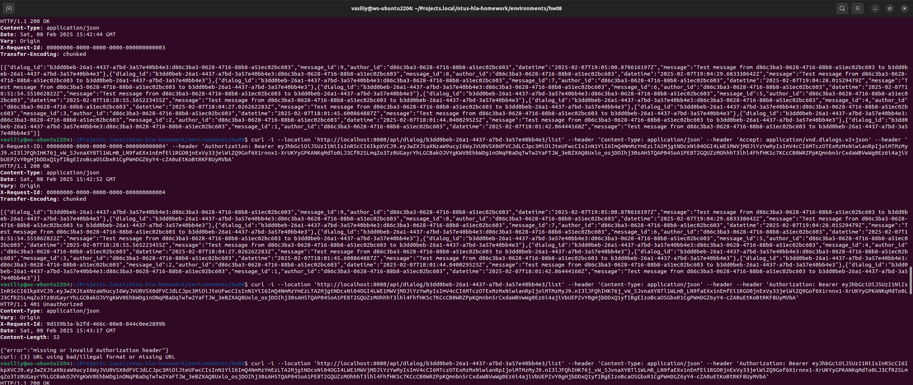
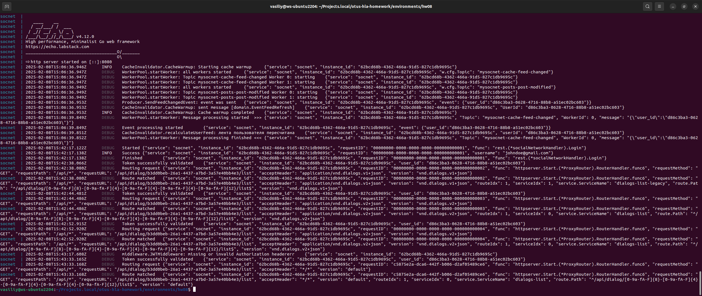
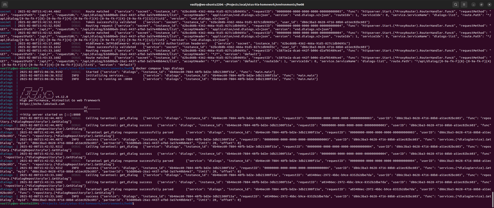
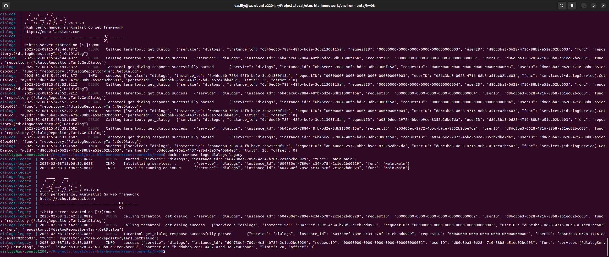

## Домашнее задание

Разделение монолита на сервисы

Цель:

В результате выполнения ДЗ вы перенесете бизнес-домен монолитного приложения в отдельный сервис.

В данном задании тренируются навыки:

- декомпозиции предметной области;
- разделение монолитного приложения;
- работа с HTTP;
- работа с REST API или gRPC.

  
Описание/Пошаговая инструкция выполнения домашнего задания:

**Реализовать функционал:**

- Вынести систему диалогов в отдельный сервис.

---

  
**Требования**

- Взаимодействия монолитного сервиса и сервиса чатов реализовать на REST API или gRPC.
- Организовать сквозное логирование запросов (x-request-id).
- Предусмотреть то, что не все клиенты обновляют приложение быстро и кто-то может ходить через старое API (сохранение обратной совместимости).

---
  
**Форма сдачи ДЗ**

- Предоставить ссылку на исходный код (github, gitlab, etc)
- Предоставить докеризированное приложение, которое можно запустить при помощи docker-compose (может лежать рядом с исходным кодом) ИЛИ развернутое приложение, доступное извне ИЛИ инструкция по запуску
 

Критерии оценки:

Оценка происходит по принципу зачет/незачет.

Требования:

1. Описан протокол взаимодействия.
2. Поддержаны старые клиенты.
3. Новые клиенты верно ходят через новый API.

Компетенции:

- Разработка и проектирование микросервисов
    - - применять технические и бизнес-паттерны декомпозиции системы на микросервисы
    - - знать принципы организации микросервисной архитектуры
    - - знать тактики достижения Observability микросервисов


## Отчет о проделанной работе

На данном этапе развития учебного проекта эта задача уже частично выполнена. Подсистема диалогов уже запускается как отдельный микросервис. Что требуется сделать, чтобы выполнить требования:

1) внедрить семантическое версионирование в контрактах (REST);
2)  реализовать сквозную передачу x-request-id через контекст;
3) навести порядок в логировании, чтобы презентабельно показать результат.


- Разработан самописный API Gateway [internal/rest/router.go](https://github.com/Vasiliy82/otus-hla-homework/blob/cef7b0dd6e65880cab3fa20df715c17aed4b0d0a/backend/internal/rest/router.go#L1-L176)
- В конфиг добавлен раздел routes [internal/config/routing.go](https://github.com/Vasiliy82/otus-hla-homework/blob/cef7b0dd6e65880cab3fa20df715c17aed4b0d0a/backend/internal/config/routing.go#L1-L13) , [internal/config/config.go](https://github.com/Vasiliy82/otus-hla-homework/blob/cef7b0dd6e65880cab3fa20df715c17aed4b0d0a/backend/internal/config/config.go#L52) , [вот пример конфигурации](https://github.com/Vasiliy82/otus-hla-homework/blob/cef7b0dd6e65880cab3fa20df715c17aed4b0d0a/environments/hw08/backend/socnet.yaml#L31-L68)
- Разработано middleware для проброса x-request-id [internal/rest/middleware/request_id.go](https://github.com/Vasiliy82/otus-hla-homework/blob/cef7b0dd6e65880cab3fa20df715c17aed4b0d0a/backend/internal/rest/middleware/request_id.go#L1-L38)
- Доработано логирование.

## Как запустить проект


```bash

git clone https://github.com/Vasiliy82/otus-hla-homework.git
git checkout tags/hw8
cd otus-hla-homework/environments/hw08
make up

# авторизоваться, чтобы получить токен
curl -i --location 'http://localhost:8080/api/login' \
--header 'Content-Type: application/json' \
--header 'X-Request-ID: 00000000-0000-0000-0000-000000000001' \
--data-raw '{"username": "johndoe@gmail.com","password": "password123"}'

# выполнить запрос версии 1
curl -i --location 'http://localhost:8080/api/dialog/b3dd0beb-26a1-4437-a7bd-3a57e40bb4e3/list' \
--header 'Content-Type: application/json' \
--header 'Accept: application/vnd.dialogs.v1+json' \
--header 'X-Request-ID: 00000000-0000-0000-0000-000000000002' \
--header 'Authorization: Bearer <token>'

# выполнить запрос версии 2

curl -i --location 'http://localhost:8080/api/dialog/b3dd0beb-26a1-4437-a7bd-3a57e40bb4e3/list' \
--header 'Content-Type: application/json' \
--header 'Accept: application/vnd.dialogs.v2+json' \
--header 'X-Request-ID: 00000000-0000-0000-0000-000000000003' \
--header 'Authorization: Bearer <token>'

# выполнить запрос без версии

curl -i --location 'http://localhost:8080/api/dialog/b3dd0beb-26a1-4437-a7bd-3a57e40bb4e3/list' \
--header 'Content-Type: application/json' \
--header 'Accept: application/vnd.dialogs.v2+json' \
--header 'X-Request-ID: 00000000-0000-0000-0000-000000000004' \
--header 'Authorization: Bearer <token>'

# выполнить запрос без X-Request-ID и без заголовка Accept

curl -i --location 'http://localhost:8080/api/dialog/b3dd0beb-26a1-4437-a7bd-3a57e40bb4e3/list' \
--header 'Content-Type: application/json' \
--header 'Authorization: Bearer <token>'

# убедиться, что во всех ответах присутствует заголовок X-Request-ID, даже если его не передавали

# убедиться, что запросы с различными версиями API маршрутизируются в разные сервисы, и что в каждом из сервисов также доступно значение X-Request-ID

docker compose logs socnet
docker compose logs dialogs
docker compose logs dialogs-legacy

# почистить за собой
make destroy
```

## Итоги функционального тестирования

Как видно на скриншотах, X-Request-ID возвращается тот же самый, если он был передан в заголовке, и формируется автоматически, если его не передали. При указании версии протокола происходит корректная маршрутизация на сервис, указанный в настройках. Если заголовок Accept не указан, происходит вызов сервиса с версией default.



Журналы сервисов socnet, dialogs, dialogs-legacy подтверждают, что маршрутизация выполняется корректно








