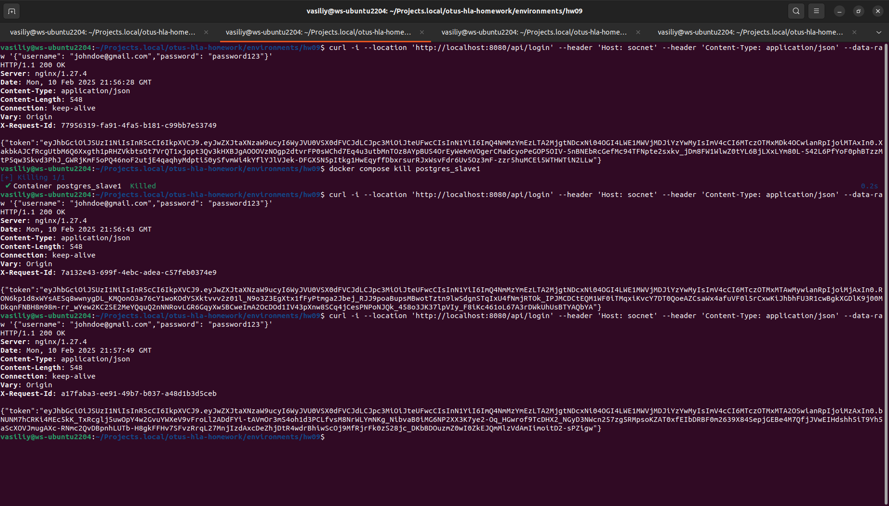
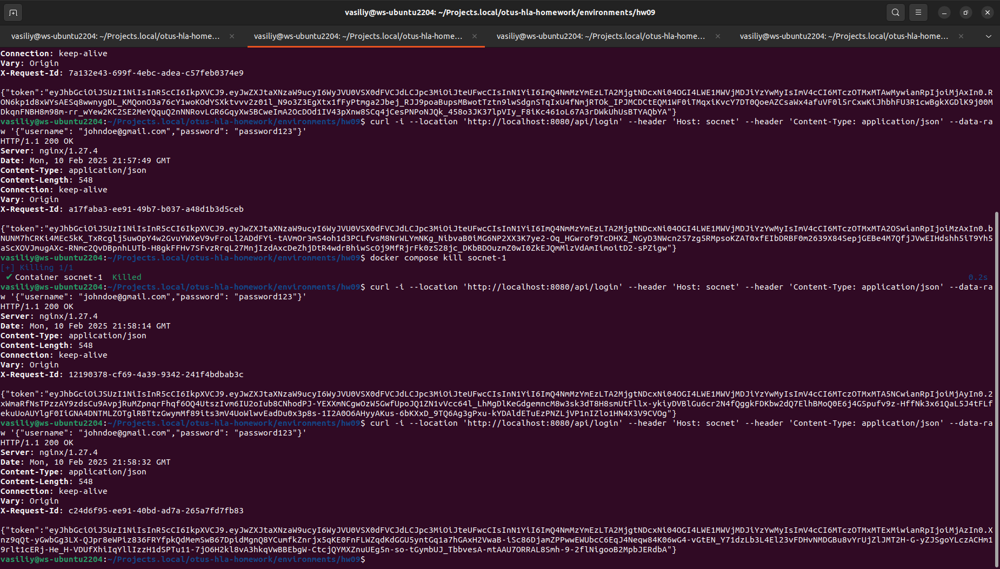

## Домашнее задание

Отказоустойчивость приложений

Цель:

В результате выполнения ДЗ вы уменьшите число точек отказа в вашем приложении.

В данном задании тренируются навыки:

- проектирование отказоустойчивых архитектур;
- настройка nginx;
- настройка HAProxy.

  

Описание/Пошаговая инструкция выполнения домашнего задания:

- Поднять несколько слейвов PostgreSQL.
- Реализовать соединение со слейвами PostgreSQL через haproxy.
- Поднять несколько приложений и обеспечить их балансировку через nginx.
- Воспроизвести нагрузку.
- Под нагрузкой с помощью "kill -9" отключить один из слейвов PostgreSQL. Убедится, что система осталась работоспособной.
- Под нагрузкой с помощью "kill -9" отключить один из инстансов бэкенда. Убедится, что система осталась работоспособной.

---

**  
Форма сдачи ДЗ**  
  
ДЗ принимается в виде отчета по выполненным пунктам.

  

Критерии оценки:

Оценка происходит по принципу зачет/незачет.

В случае подачи ДЗ с использованием технологии PostgreSQL, убедиться что пункты по работоспособности выполнены

Требования:

1. В отчете верно описана конфигурация haproxy. (MySQL)
2. В отчете верно описана конфигурация nginx. (MySQL)
3. В отчете верно описаны условия эксперимента.
4. В отчете должны быть логи работы системы.

  

Компетенции:

- Разработка и проектирование высоконагруженных систем
    - - иметь представление о балансировке DNS-сервера и отказоустойчивости
- Работа с высоконагруженными БД
    - - знать тактики достижения Availability

## Отчет о проделанной работе

- **PostgreSQL и репликация**:  
    Были развернуты основной сервер PostgreSQL и два слейва (`postgres_slave1`, `postgres_slave2`). Репликация настроена с использованием роли `replicator`, а конфигурация хранения и подключения была определена в файлах [`postgresql.conf`](https://github.com/Vasiliy82/otus-hla-homework/blob/39c540f6ccd15dbdb4f7ea21e1ee3b66d1526ec7/environments/hw09/postgres/postgresql.conf#L1-L28) и [`pg_hba.conf`](https://github.com/Vasiliy82/otus-hla-homework/blob/39c540f6ccd15dbdb4f7ea21e1ee3b66d1526ec7/environments/hw09/postgres/pg_hba.conf#L1-L6).
    
- **HAProxy**:  
    Для балансировки нагрузки между слейвами PostgreSQL настроен HAProxy. Использованы активные проверки доступности серверов через [TCP-чек](https://github.com/Vasiliy82/otus-hla-homework/blob/39c540f6ccd15dbdb4f7ea21e1ee3b66d1526ec7/environments/hw09/haproxy/haproxy.cfg#L16-L19).
    Статистика HAProxy доступна по адресу [`http://localhost:8404/stats`](http://localhost:8404/stats).
    
- **Микросервисы и Nginx**:  
    Развернуты два экземпляра сервиса `socnet` и два экземпляра сервиса `dialogs`. Для балансировки нагрузки между ними [настроен Nginx](https://github.com/Vasiliy82/otus-hla-homework/blob/39c540f6ccd15dbdb4f7ea21e1ee3b66d1526ec7/environments/hw09/nginx/nginx.conf#L4-L12) с быстрым переключением на доступные сервера при отказах.
   

## Как запустить проект
```bash

git clone https://github.com/Vasiliy82/otus-hla-homework.git
cd otus-hla-homework
git checkout tags/hw9
cd environments/hw09
make up

## 1) Проверить работоспособность сервиса
curl -i --location 'http://localhost:8080/api/login' \
--header 'Host: socnet' \
--header 'Content-Type: application/json' \
--data-raw '{"username": "johndoe@gmail.com","password": "password123"}'

## 2) остановить один из сервисов СУБД, postgres_slave1

docker compose kill postgres_slave1

## 3) Проверить работоспособность сервиса
curl -i --location 'http://localhost:8080/api/login' \
--header 'Host: socnet' \
--header 'Content-Type: application/json' \
--data-raw '{"username": "johndoe@gmail.com","password": "password123"}'

## 4) остановить один из сервисов бекенда, socnet-1

docker compose kill socnet-1

## 5) Проверить работоспособность сервиса
curl -i --location 'http://localhost:8080/api/login' \
--header 'Host: socnet' \
--header 'Content-Type: application/json' \
--data-raw '{"username": "johndoe@gmail.com","password": "password123"}'

# почистить за собой
make destroy
```


## Итоги проверки отработки отказов

1. **Успешная проверка отказоустойчивости**:    
    - Все тесты показали, что система остается работоспособной при отказе отдельных узлов как на уровне базы данных, так и на уровне бекенд-сервисов.
    - HAProxy и Nginx корректно балансировали нагрузку между доступными узлами.
2. **Проблемы и их решения**:    
    - **Задержки при отказе бекендов**:  
        Первоначально возникли задержки при отказе одного из сервисов, связанные с настройками таймаутов в Nginx. После уменьшения `fail_timeout` и количества повторных попыток (`proxy_next_upstream_tries`), время реакции сократилось.       
    - **Различия в работе HAProxy и Nginx**:  
        HAProxy более быстро реагирует на отказ и восстановление серверов благодаря активным проверкам состояния (health checks). В Nginx были настроены агрессивные параметры пассивного мониторинга, чтобы минимизировать задержки.        






